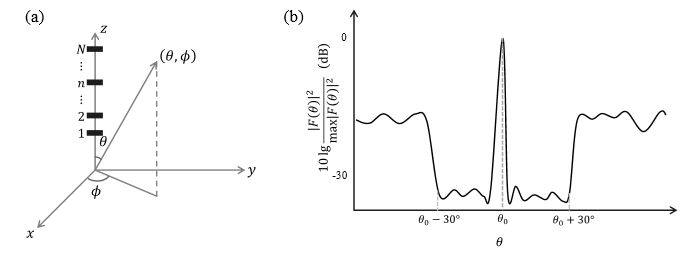
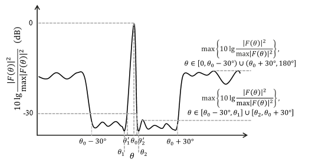
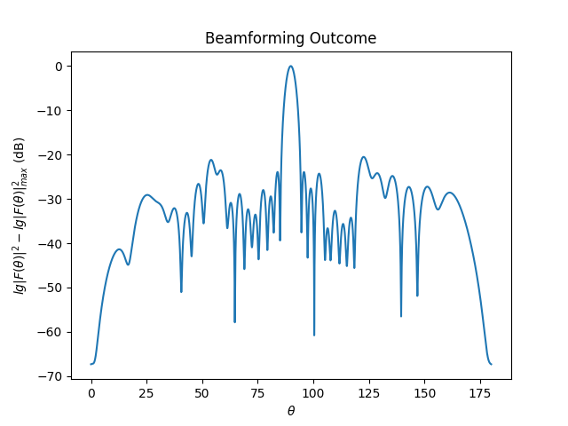

# 【赛题名称】基于量子启发算法的波束赋形问题

##  【赛题背景】

通过调整天线阵列中天线阵子的振幅和相位可以实现针对特定场景的波束赋形，在某些场景中需要尽可能收窄主瓣的波束宽度，同时压制特定区域旁瓣的信号强度。该问题是典型的组合优化问题，本赛题期望选手基于量子启发算法对该问题进行优化。

## 【赛题建模】

**图1(a)天线阵列建模示意图。赛题中采用的是等间距半波长线性排列的天线阵子（用黑色直线表示，忽略天线阵子的具体结构）组成的天线阵列，所有的N个天线阵子都在z轴上，极坐标系和直角坐标系间的转换关系也在图中绘出，其中，$\theta$ 为方向向量与z轴的夹角，$\phi$为方向向量投影在xy平面后与x轴的夹角。$\theta\in[0,\pi],\phi \in[0,2\pi)$。(b)波束赋形目标示意图，其中$\theta_0$是主瓣指向。**

假设采用$N$个天线阵子组成如图1（a）所示的线阵。以$\left| F(\theta,\phi) \right|^{2}$度量天线阵在$(\theta,\phi)$方向的信号强度（对于一维线阵，不妨取$\phi = 90{^\circ}$方向进行研究，之后略去$\phi$，理想的$\ |F(\theta)|^2$关于$\theta$的关系如图1（b）所示）。其中：

$$\begin{array}{r}
\left| F(\theta) \right|^{2} = E(\theta)\left\lbrack \displaystyle\sum_{n = 1}^{N}{A_{n}(\theta)} \right\rbrack\left\lbrack \displaystyle\sum_{n = 1}^{N}{A_{n}^{*}(\theta)} \right\rbrack\tag{1}
\end{array}$$

阵因子：

$$\begin{array}{r}
A_{n}(\theta) = I_{n}\exp\left\{ \pi in\cos\theta \right\}\tag{2}
\end{array}$$

天线单元因子：

$$\begin{array}{r}
E(\theta) = 10^{\frac{E_{dB}(\theta)}{10}}
\tag{3}
\end{array}$$

$$\begin{array}{r}
E_{dB}(\theta) = - \min\left\{ 12\left( \frac{\theta - 90{^\circ}}{90{^\circ}} \right)^{2},30 \right\}
\tag{4}
\end{array}$$

其中，$\theta \in \lbrack 0{^\circ},\ 180{^\circ}\rbrack$，$\theta_{0}$为主瓣成像方向，$I_{n} = \beta_{n}\exp{i\alpha_{n}}$，$\alpha_{n}$是第$n$个阵子的相位角（可在$\lbrack 0,\ 2\pi)$范围内按照$k{_1}$比特离散调节，以$k{_1}=2$为例，可以调节的相位角为$\left\{0,\frac{\pi}{2},\pi,\frac{3\pi}{2}\right\}$这$2^{k_1}$个离散变量），$\beta_{n}$是第$n$个阵子的振幅（可在$\lbrack 0,1\rbrack$的范围内连续变化/不做优化）。相位在不同的量化比特数下允许的离散取值情况也可以参考样例代码。当天线阵子数目$N$很大时，基于传统方法寻求最优$\left\{ \alpha_{n},\beta_{n} \right\}$的难度很大。本赛题要求参赛选手基于量子启发算法（或将量子启发算法与其他优化方法结合），构建算法以自动搜寻在主瓣方向$\theta_{0} \in \lbrack 45{^\circ},135{^\circ}\rbrack$的连续范围内最优的相位-振幅序列$\left\{ \alpha_{n},\beta_{n} \right\}$，使其满足如下场景的需求：

$N = 32$的天线阵列，同时满足如下3点（1）压制成形方向$\left\lbrack \theta_{0} - 30{^\circ},\theta_{0} + 30{^\circ} \right\rbrack$内旁瓣强度$\left| F(\theta) \right|^{2}$，使其强度至少低于主瓣强度$\left| F\left( \theta_{0} \right) \right|^{2}$的-30dB，（2）在$0{^\circ} \leq \theta < \theta_{0} - 30{^\circ}$和$\theta_{0} + 30{^\circ} < \theta \leq 180{^\circ}$的范围内旁瓣强度$\left| F(\theta) \right|^{2}$低于主瓣强度$\left| F\left( \theta_{0} \right) \right|^{2}$的-15dB。（3）减小主瓣的宽度$W$，最好能达到$8{^\circ}$。具体评分细节见评分规则。

## 【评分规则】
赛题要求参赛选手编写优化函数，包含纯相位优化和相位振幅联合优化功能（振幅连续变化，相位角1-4比特量化），以目标波束成形方向$\theta_{0}$、相位角量化比特数以及是否优化振幅为输入，天线阵子的相位序列$\left\{ \alpha_{n} \right\}$和振幅序列$\left\{ \beta_{n} \right\}$为输出。打分函数会在一组赛事方设定的输入下（每组输入包括目标波束成形方向（随机选取）$\theta_{0,i}$、相位离散编码个数（$k_{1}$）和是否优化振幅的控制变量），作为参赛选手优化函数的输入，并根据优化函数输出的相位序列$\left\{ \alpha_{n} \right\}$和振幅序列$\left\{ \beta_{n} \right\}$计算该组输入（下文简记为$\theta{_0,_i}$）$_{}$下的分数$y_{i}$，而总成绩$y$为对$y_{i}$的平均。

**图2 理想的波束赋形目标图案和评分规则中各物理量对照图**

具体地，针对某一个波束方向$\theta_{0,i}$的分数$y_{i}$的计算，程序会首先根据相位序列$\left\{ \alpha_{n} \right\}$和振幅序列$\left\{ \beta_{n} \right\}$，计算出$\left| F(\theta) \right|^{2}$（样例代码中有相关函数确保相位角的取值落在允许的离散的取值集合里），再根据下式计算出对应的分数。理想的波束赋形目标图案和评分函数示意图如图2所示。

$$\begin{array}{r}
y_{i} = 1000 - 100a - 80b - 20c
\tag{5}
\end{array}$$

其中：

$$\begin{array}{r}
a = \max\left\{ 15 + \max\left\{ 10\lg\frac{\left| F(\theta) \right|^{2}}{\max\left| F(\theta) \right|^{2}} \right\},0 \right\},\ \theta \in \left\lbrack 0,\theta_{0} - 30{^\circ} \right) \cup \left( \theta_{0} + 30{^\circ},180{^\circ} \right
\rbrack \tag{6}
\end{array}$$

$$\begin{array}{r}
b = \max\left\{ W - 6{^\circ},\ 0{^\circ} \right\}
\tag{7}
\end{array}$$

$$\begin{array}{r}
c = \max\left\{ 10\lg\frac{\left| F(\theta) \right|^{2}}{\max\left| F(\theta) \right|^{2}} + 30 \right\},\theta \in \left\lbrack \theta_{0} - 30{^\circ},\theta_{1} \right\rbrack \cup \left\lbrack \theta_{2},\theta_{0} + 30{^\circ} \right\rbrack
\tag{8}
\end{array}$$

 $\theta_{1}$和$\theta_{2}$为主瓣左右两侧强度$\left| F(\theta) \right|^{2}$随着$\theta$减小/增加达到第一个极小值时分别对应的角度；主瓣宽度$W$定义为主瓣左右两侧强度$\left| F(\theta) \right|^{2}$随着$\theta$减小/增加达到比峰值低-30dB时分别对应的角度$\theta_{1}'$和$\theta_{2}'$之差：

 $$\ W = \theta_{2}' - \theta_{1}' \tag{9}$$

如果$\left| F\left( \theta_{1} \right) \right|^{2}$或者$\left| F\left( \theta_{2} \right) \right|^{2}$相比于主瓣的下降小于30dB，即：

$$10\lg\frac{\left| F\left( \theta_{1} \right) \right|^{2}}{\max\left| F(\theta) \right|^{2}} \geq - 30\ or\ 10\lg\frac{\left| F\left( \theta_{2} \right) \right|^{2}}{\max\left| F(\theta) \right|^{2}} \geq - 30$$

则计本次分数$y_{i} = 0$。

同时，还要求主瓣方向（使得$\left| F(\theta) \right|^{2}$取得最大值的$\theta$）与目标波束成形方向$\theta_{0}$相差不超过$1{^\circ}$：

$$\begin{array}{r}
\left| \theta - \theta_{0} \right| \leq 1{^\circ}
\tag{10}
\end{array}$$

如果超过$1{^\circ}$直接置此次分数$y_{i} = 0$。

如果选手优化出的结果根据式（5）计算出的分数$y_{i} < 0$，则认为此次优化结果不符合要求，并且重新赋值$y_{i} = 0$

具体评分规则的算法实现可参考样例代码中的get_score()函数。

## 【其他要求】

（1）评分算力采用华为云资源（实例类型：内存优化型m7，规格名称：m7.4xlarge.8），2U4G。赛题要求参赛选手在上述资源下优化任意单个目标波束的时间不超过90秒，如果超过要求的优化时间则会将该波束下优化的得分记为$y_{i} = 0$。

（2）编程语言基于Python3.9进行。

（3）JupyterLab环境调试代码：<https://authoring-modelarts-cnnorth4.huaweicloud.com/console/lab?imageid=9759d934-67ab-4c5a-bd32-480287658a74>

（4）赛题鼓励参赛选手使用量子启发算法进行优化。量子启发算法可参考mindquantum中相关文档和样例代码：<https://www.mindspore.cn/mindquantum/docs/zh-CN/r0.10/case_library/quantum_annealing_inspired_algorithm.html>。

（5）参赛选手需要输出answer.py文件作为答案，其中optimized()函数为判题调用的函数接口，输入变量和输出变量请勿修改。

（6）赛事组织方会检查选手代码，如果代码中出现以下行为（包括但不限于），将会直接将参赛选手最终得分置为0：直接将预先优化出的结果写入代码、直接将现有解析公式的结果作为输出、基于预先数值优化出的结果进行微调的、其他代码中不含有任何优化模块或者优化模块和最终输出结果无关的情况等。

（7）本赛题内容与评分规则的最终解释权归主办方所有。

## 【样例代码】

**样例代码目录结构说明**：

 1.  answer.py 赛题一种实现思路的样例代码（基于torch微分实现）

 2.  run.py 判题系统的判题脚本，用于选手调试程序（对应answer.py）

 3.  answer_1.py 赛题另一种实现思路样例代码（基于mindquantum中QAIA量子启发算法库实现）

 4.  run_1.py 判题系统的判题脚本，用于选手调试程序（对应answer_1.py）

样例代码提供了answer.py和answer_1.py两个版本。在answer.py中，采用了bSB/dSB和Adam算法结合的方法进行相位和振幅优化。样例代码中基于量子启发算法搜索最优离散角度；然后再基于Adam算法搜索固定相位下的振幅。对于其中的bSB/dSB算法有：

$$\begin{array}{r}
{\dot{x}}_{i} = y_{i}\
\tag{11}
\end{array}$$

$$\begin{array}{r}
{\dot{y}}_{i} = \left\{ \begin{array}{r}
 -\left( \Delta - p(t) \right)x_{i} + \xi\frac{\partial C\left( x_{i} \right)}{\partial x_{i}},\ bSB \\
-\left( \Delta - p(t) \right)sign\left( x_{i} \right) + \xi\frac{\partial C\left( sign\left( x_{i} \right) \right)}{\partial x_{i}}\ ,\ dSB
\end{array} \right.
\tag{12}
\end{array}$$

$$\begin{array}{r}
x_{i} = {\dot{x}}_{i}\Delta t,\ y_{i} = {\dot{y}}_{i}\Delta t,\ when\ \left| x_{i} \right| < 1
\tag{13}
\end{array}$$

$$\begin{array}{r}
x_{i} = sign\left( x_{i} \right),\ y_{i} = 0,\ when\ \left| x_{i} \right| \geq 1
\tag{14}
\end{array}$$

代码中，$\Delta = 0.5$，$p(t)$为从0到1随时间均匀变化的系数。采用对不同范围加权后求平均值再除以主瓣信号强度的形式作为损失函数：

$$\begin{array}{r}
C = \frac{wS}{\left| F\left( \theta_{0} \right) \right|^{2}}
\tag{15}
\end{array}$$

其中，$w$是可调节的参数权重，以保证分子和分母之间的差距接近。$S$是一定范围内旁瓣信号强度的加权平均值，在样例代码中有：

$$\begin{array}{r}
S = avg\ \left\{ a_{i}\left| F\left( \theta_{i} \right) \right|^{2} \right\},\ \theta_{i} \in \left\lbrack 0{^\circ},\theta_{0} - \frac{W}{2} \right\rbrack \cup \left\lbrack \theta_{0} + \frac{W}{2},180{^\circ} \right
\rbrack \tag{16}
\end{array}$$

其中，$a_{i}$是不同角度信号强度$\left| F\left( \theta_{i} \right) \right|^{2}$前的权重。

样例代码中针对的是2比特的编码，针对$\{0,\frac{\pi}{2},\pi,\frac{3\pi}{2}\}$这四个离散变量有：

$$\ I_{n}=\frac{1+i}{2}x{_n},{_0}+\frac{1-i}{2}x{_n},{_1} \tag{17}$$

针对对$2^{M}$个均匀分布的相位角$\alpha_{n}$表示的相位$I_{n}$可以$M$个自旋比特进行编码（可以参考文献：https://arxiv.org/pdf/2409.19938 ），进而将其转换为多项式的形式：

$$\begin{array}{r}
I_{n} = \displaystyle\sum_{i}^{}{c_{i}x_{i}} + \sum_{ijk}^{}{c_{ijk}x_{i}x_{j}x_{k}} + \sum_{ijklm}^{}{c_{ijklm}x_{i}x_{j}x_{k}x_{l}x_{m}} + \ldots;x_{i},x_{j},\ldots = \pm 1 \tag{18}
\end{array}$$

answer_1.py这一样例代码遵从了和answer.py中相似的代码结构，主要区别在于：

 （1）给出了调用mindquantum中量子启发算法模块QAIA对2比特相位编码的优化示例而不是利用torch微分；

（2）程序中采用的损失函数形式是最大化主瓣减去加权旁瓣的形式，并且将该形式转化为QAIA模块中接受的耦合矩阵$\ J$的输入形式。

$$\ C =|F(\theta{_0})|^2-wS\tag{19}$$

（3）answer_1.py没有包含振幅优化模块。

最后运行样例代码就可以得到如下结果图：

**图3 最后优化出的最优归一化信号强度$\left| \mathbf{F}\left( \mathbf{\theta} \right) \right|^{\mathbf{2}}$示意图**

 样例代码中各主要函数的功能如表1所示：

**表1 样例代码中各主要函数的功能**

|  函数    |    功能  |
| ---- | ---- |
|  get_score()    |   打分函数，对应式（5）-（10）   |
|   get_efield()   |    根据式（3）（4）生成E($\theta$)，根据式（2）生成$\exp\ \{πin \cos\ \theta \}$部分，再根据张量积生成在优化过程中不变的系数efield  |
|   cos_f(x), sin_f(x)   |  角度制下的正弦和余弦函数    |
|   BF.\__init__()   |    初始化参数   |
|    BF.solve()  |     控制相位和振幅优化求解过程 |
|    BF.opt_phase()  |   通过torch微分，基于式（11）-（14）和损失函数（15）进行相位优化   |
|   BF.opt_phase_QUBO()   |    通过调用mindquantum中QAIA量子启发代码模块，基于式（11）-（14）和损失函数（19）进行相位优化  |
|  BF. opt_amp()    |   基于Adam，调用对应损失函数进行振幅优化   |
|  BF.encode()  |    基于式（17）的2比特编码实现  |

## 【参考文献】

[1] Jiang, Y., Ge, H., Wang, B. et al. Quantum-inspired Beamforming Optimization for Quantized Phase-only Massive MIMO Arrays. (2024). https://arxiv.org/abs/2409.19938 

[2] Zeng, Q., Cui, X., Liu, B. et al. Performance of quantum annealing inspired algorithms for combinatorial optimization problems. Commun. Phys. 7, 249 (2024). https://doi.org/10.1038/s42005-024-01705-7